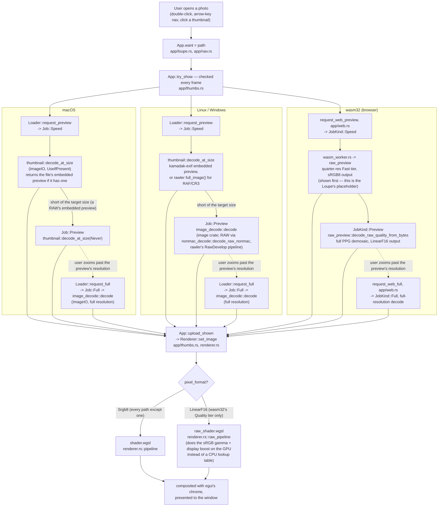
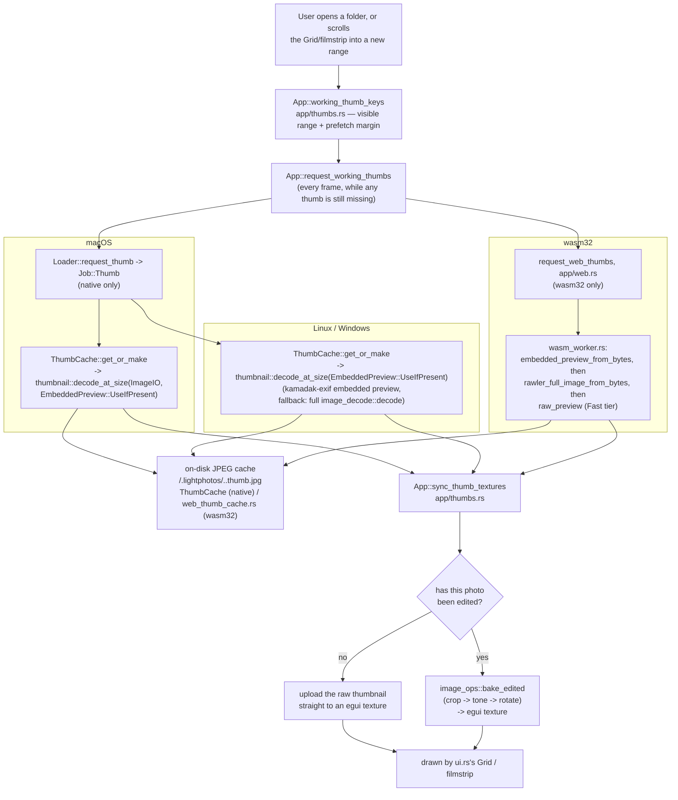
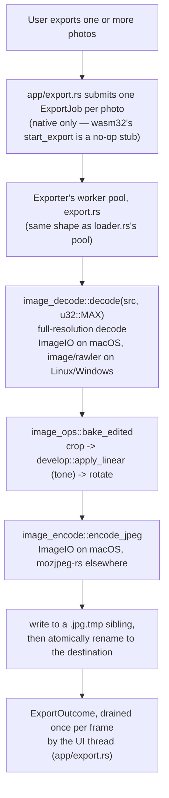

# Architecture: the three decode/render pipelines

This document explains **when** each piece of the codebase runs, in the order
a photo actually moves through it, across the three platform targets: macOS,
Linux/Windows ("non-mac"), and wasm32 (the browser build). It complements
`CLAUDE.md` (module map), [`docs/PROJECT_LAYOUT.md`](docs/PROJECT_LAYOUT.md)
(directory listing), and `plans/` (design history) — this file is about
*sequencing*, not module boundaries.

There are three pipelines a photo passes through, each triggered by a
different user action:

1. **Opening a photo** — decoding it into the Loupe.
2. **Browsing a folder** — decoding thumbnails for the Grid/filmstrip.
3. **Exporting a photo** — baking edits into a JPEG on disk.

All three fork into per-platform decode/encode code but converge back onto
shared, platform-independent code (the tone pipeline, the GPU renderer, the
pixel-ops math) — that convergence is what guarantees the three platforms
*look* the same even though they decode differently.

## Two independent platform axes, not three parallel copies

Before the pipelines: the "three platforms" aren't three separate module
trees. Two independent `cfg` axes combine into three realized cases
(macOS+wasm32 never occurs):

- **`cfg(target_os = "macos")`** — gates everything built on Apple's
  ImageIO/CoreGraphics (`image_decode.rs`, `image_encode.rs`, `thumbnail.rs`,
  `coregraphics.rs`). The `not(macos)` arm of each is Linux/Windows *and*
  wasm32's fallback code.
- **`cfg(target_arch = "wasm32")`** — gates the browser-only plumbing
  (`web/*.rs`) and the parts of `loader.rs`/`export.rs` that can't use real OS
  threads there.

What that means in practice:

- "Non-mac" in a doc comment usually means "Linux, Windows, *and* wasm32
  before its own worker pool takes over."
- wasm32 reuses the non-mac decode *functions* (`raw/nonmac_decode.rs`,
  `raw/preview.rs`) but drives them from Web Workers instead of native
  threads.
- wasm32 feeds results into `loader.rs`'s caches through a side door
  (`insert_*_external`) instead of through its normal job queue.

---

## Pipeline 1 — Opening a photo (the Loupe)

Triggered by: double-clicking a photo, arrow-key navigation, or opening a
file/folder from the command line or Finder.

**Why the two-pass split exists (`Speed` then `Preview`):**
- A RAW file's embedded JPEG preview decodes in ~35ms; demosaicing the
  sensor data to the same size takes ~250ms.
- Showing the cheap pass first and upgrading in place is what makes opening
  a RAW file feel instant instead of frozen.
- A JPEG has no embedded preview, so its Speed pass already decodes at the
  target size — the upgrade pass is skipped entirely, at no extra cost.

**Why wasm32 stops at `LinearF16` for its Quality tier:**
- The full PPG demosaic on wasm32 is CPU-bound and single-photo (not a grid
  flood), so it's worth doing properly.
- Baking the sRGB gamma and display brightness/contrast boost into a CPU
  lookup table (the way every other RAW path does) would mean re-doing that
  work on every zoom/pan repaint.
- Instead the decode stops at linear camera-RGB, uploads as an `Rgba16Float`
  texture, and `raw_shader.wgsl` does that last step on the GPU once per
  frame instead of once per decode.

**Where full resolution comes from:**
- `Loader::request_full` (native) and `request_web_full` (wasm32) are only
  called once `ensure_full_for_zoom` (`app/loupe.rs`) decides the current
  zoom would show detail the preview doesn't have.
- Normal browsing at "fit to window" never triggers it.

---

## Pipeline 2 — Browsing a folder (Grid / filmstrip thumbnails)

Triggered by: opening a folder, or scrolling the Grid/filmstrip so a new
range of thumbnails becomes the "working set."

**Why the disk cache lives in the photo folder:**
- The picked folder's own File System Access handle is the only place wasm32
  can write, so a cache anywhere else can't exist in a browser at all. Putting
  it beside the photos is what makes the browser build cache thumbnails.
- `.lightphotos/` is already there for ratings and develop edits, is already
  created lazily on first write, and already travels with the photos when a
  folder is moved or copied. The cache inherits all of that, and a folder
  cached natively populates instantly in the browser and the reverse.
- Entries are JPEGs, not raw RGBA: ~45 KB rather than ~700 KB each, which
  matters both in the user's own folder and on web, where every byte crosses
  File System Access.
- One entry per photo, always at `THUMB_PX`, so a folder's cache is bounded
  by its photo count. There is no byte budget; cleanup is
  `thumbnail::sweep_orphans` at folder open, dropping entries whose photo is
  gone or has changed.
- A folder that can't be written just decodes every session. Writes are
  best-effort and their failure is never surfaced.

**Why edits are baked at upload time, not cached alongside the raw
thumbnail:**
- The loader/disk thumbnail cache key is the photo's size and mtime, not its
  edits, so a develop-panel tweak doesn't invalidate the expensive decode.
- Only the cheap `image_ops::bake_edited` re-runs, and only for the texture
  that's actually on screen.

---

## Pipeline 3 — Exporting a photo

Triggered by: File → Export, for one photo or a batch.

**Why exporting bakes pixels rather than reusing a cached decode:**
- Export wants the full-resolution source, which the Loupe/Grid pipelines
  only fetch on demand (zoom-in) or never (thumbnails are capped small).
- So export always does its own full decode, on a worker so it doesn't
  freeze the confirmation modal.

**Where `image_ops::bake_edited` is shared:**
- Export (full resolution) and Grid thumbnails (thumbnail size) are the only
  two callers — nothing else bakes edits into pixels.
- That's deliberate: it's what guarantees an exported JPEG matches what the
  user saw on screen.

---

## File index

| File | Pipeline stage | Platform |
|---|---|---|
| `loader.rs` | Job queue + LRU caches for both the Loupe and Grid tiers | native (macOS + Linux/Windows); wasm32 shares its caches via `insert_*_external` but bypasses its queue |
| `image_decode.rs` | Full decode + metadata read, mac arm | macOS |
| `raw/nonmac_decode.rs` | Full decode + metadata read, non-mac arm (`image` crate + `rawler`) | Linux/Windows; RAW/JPEG-decode functions also reused by wasm32 |
| `raw/preview.rs` | Two-tier RAW preview (`Fast`/`Quality`) used by the Loupe's wasm32 path | wasm32 (also reachable from a mac dev build via `--features raw-probe`) |
| `raw/render.rs` | Builds the GPU tonemap pipeline for `PixelFormat::LinearF16` images | all (only ever fed a linear image on wasm32) |
| `thumbnail.rs` | Decode-at-size for both the Loupe's screen-fit preview and Grid thumbnails, plus the on-disk `.tw` cache | macOS (ImageIO) + Linux/Windows (`kamadak-exif`/`rawler`); disk cache is native-only |
| `image_encode.rs` | JPEG write for export | macOS (ImageIO) / Linux/Windows (`mozjpeg-rs`) |
| `coregraphics.rs` | Shared CFURL/bitmap-context setup for `image_decode.rs`/`image_encode.rs` | macOS |
| `renderer.rs` | GPU upload + draw of the currently-shown image | all (wgpu → Metal / Vulkan-GL / WebGPU) |
| `develop.rs` | The tone pipeline (`apply_linear`), shared by the GPU shader and the CPU histogram/bake path | all |
| `image_ops.rs` | Pure pixel math (crop/rotate/bake) shared by export and thumbnail baking | all |
| `export.rs` | Worker pool that decodes, bakes, and encodes a full-resolution JPEG | native only (wasm32 stubbed) |
| `web/wasm_worker.rs` | The Web Worker binary that actually decodes bytes off the main thread | wasm32 |
| `web/web_worker_pool.rs` | Main-thread side of the Web Worker pool: job dispatch + result routing | wasm32 |
| `web/web_canvas.rs` | Attaches winit's canvas into the DOM at the right backing-store resolution | wasm32 |
| `web/web_fs.rs` | File System Access folder picking/listing/byte reads | wasm32 |
| `web/web_catalog_fs.rs` | File System Access counterpart of `catalog.rs`'s sidecar I/O | wasm32 |
| `app/loupe.rs` | View-state math (zoom/pan/fit) and the decision to fetch full resolution | all |
| `app/thumbs.rs` | `try_show`'s tier-selection logic, thumbnail texture sync, burst/duplicate scoring hooks | all |
