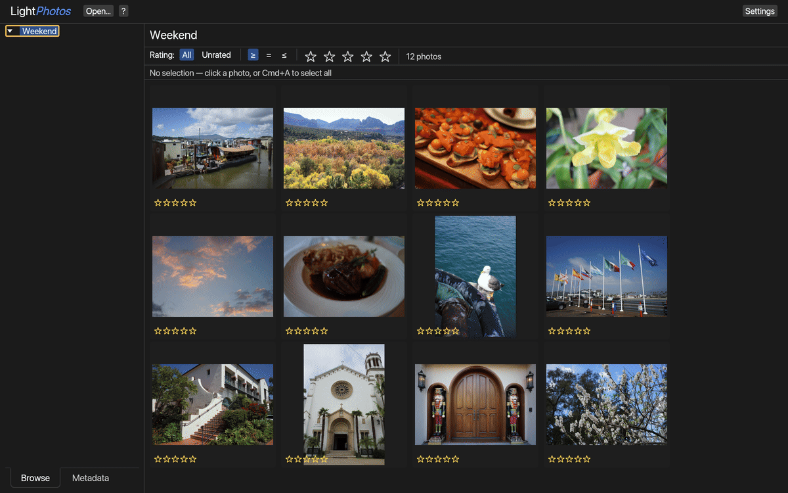

<!-- SPDX-License-Identifier: MIT OR Apache-2.0 -->

<h1></h1>

## What it does

LightPhotos is a fast, Lightroom-lite photo culling and develop tool written in
Rust. Open a folder to browse thumbnails in a Grid, rate and filter them, and
open any photo in the Loupe to zoom, pan and edit. JPEG, PNG, TIFF, HEIC and
camera RAW are supported. Ratings and edits are saved to a `.lightphotos` folder next to your photos, so
the originals are never modified.



It runs on macOS, Linux and Windows, and in the browser. Downloads and the
browser version are at **[lightphotos.app](https://lightphotos.app)**. HEIC and
the Vision-backed features (face/blink scoring, subject selection) are
macOS-only.

Keyboard shortcuts are in [`docs/KEYBOARD_SHORTCUTS.md`](docs/KEYBOARD_SHORTCUTS.md)
(or press `?` in the app). The architecture diagrams are in
[`docs/SYSTEM_DIAGRAM.md`](docs/SYSTEM_DIAGRAM.md).

## How to build it from scratch

You need [Rust](https://rustup.rs). The repo picks the right toolchain for you.

### Desktop build

```sh
./scripts/setup.sh           # once per clone, and again when the rawler dependency changes
./scripts/build.sh release   # or: ./scripts/build.sh debug
./target/release/lightphotos /path/to/a/folder
```

The debug build works but decodes and renders much more slowly. On Windows, run
the scripts from Git Bash.

### Web build

Install [trunk](https://trunkrs.dev) once (`brew install trunk` or
`cargo install --locked trunk`), then:

```sh
./scripts/setup-web.sh    # once per clone, and again when the rawler dependency changes
./scripts/deploy-web.sh   # builds and copies the result into the lightphotos.app site repo
```

`deploy-web.sh` expects the site repo at `../lightphotos-app` (or set
`LIGHTPHOTOS_SITE_DIR`). It doesn't commit there, so review the diff and commit
it yourself.

### Live profiling (optional)

Only for profiling, not for normal builds. With a
[lightwatch](https://github.com/andrewyao/lightwatch) checkout at
`../lightwatch`:

```sh
./scripts/lightwatch-up.sh /path/to/a/folder   # starts an instrumented app and opens http://127.0.0.1:7700
./scripts/lightwatch-down.sh                   # stops everything lightwatch-up.sh started
```

The page shows function timings and live-object counts while you use the app.

## Releasing and packaging

```sh
./scripts/release.sh
```

This runs the tests, tags `origin/main` with the next patch version (or the
one you pass, e.g. `./scripts/release.sh v0.2.0`), and pushes the tag. CI then
builds the macOS `.dmg`s, Linux tarballs and Windows zip and publishes the
GitHub Release. The checkout must be clean and at `origin/main`.

---

Dual-licensed under either [MIT](LICENSE-MIT) or [Apache 2.0](LICENSE-APACHE),
at your option.

The Linux, Windows and web builds also include a modified copy of
[rawler](https://crates.io/crates/rawler) for camera RAW decoding. rawler and
the patches to it in `patches/` are licensed under the
[GNU LGPL v2.1](patches/LICENSE-LGPL). The macOS build does not include it.
