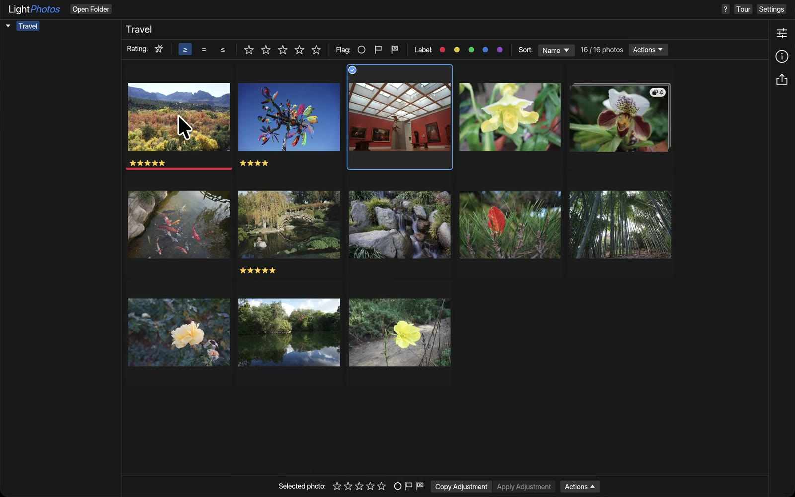
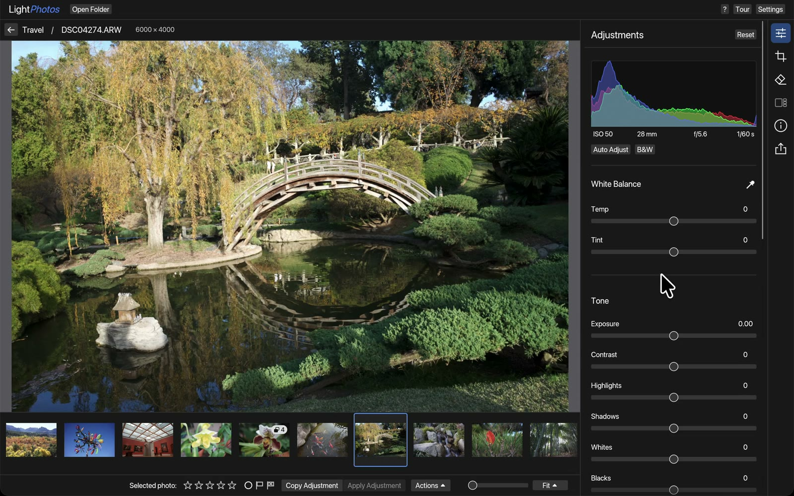

<!-- SPDX-License-Identifier: MIT OR Apache-2.0 -->

<h1></h1>

## What it does

LightPhotos is a fast, Lightroom-lite photo culling and develop tool written in
Rust. Open a folder to browse thumbnails in a Grid, rate and filter them, and
open any photo in the Loupe to zoom, pan and edit. JPEG, PNG, TIFF, HEIC and
camera RAW are supported. Ratings and edits are saved to a `.lightphotos` folder next to your photos, so
the originals are never modified.





It runs on macOS, Linux and Windows, and in the browser. Downloads and the
browser version are at **[lightphotos.app](https://lightphotos.app)**. HEIC and
the Vision-backed features (face/blink scoring) are
macOS-only.

Keyboard shortcuts are in [`docs/KEYBOARD_SHORTCUTS.md`](docs/KEYBOARD_SHORTCUTS.md)
(or press `?` in the app). The architecture diagrams are in
[`docs/SYSTEM_DIAGRAM.md`](docs/SYSTEM_DIAGRAM.md).

## How to build it from scratch

You need [Rust](https://rustup.rs). The repo picks the right toolchain for you.

### Desktop build

```sh
./scripts/setup.sh           # once per clone, and again when the rawler dependency changes
./scripts/build.sh release   # or: ./scripts/build.sh debug
./target/release/lightphotos /path/to/a/folder
```

The debug build works but decodes and renders much more slowly. On Windows, run
the scripts from Git Bash.

### Web build

Install [trunk](https://trunkrs.dev) once (`brew install trunk` or
`cargo install --locked trunk`), then:

```sh
./scripts/setup-web.sh    # once per clone, and again when the rawler dependency changes
./scripts/deploy-web.sh   # builds and copies the result into the lightphotos.app site repo
```

`deploy-web.sh` expects the site repo at `../lightphotos-app` (or set
`LIGHTPHOTOS_SITE_DIR`). It doesn't commit there, so review the diff and commit
it yourself.

### Profiling (optional)

`hotpath` instruments the paths a culling session waits on. Listing a folder gates the rest and always runs. Behind it sit the grid's screenful of thumbnails, the filmstrip's sliding window of them, the first pixels of a photo and the preview escalation that sharpens them, the full-resolution decode a zoom needs, an Auto Tone batch, a JPEG export batch, and the Vision signals. It is off unless a feature turns it on, and with its own features off its macros hand the function body back unchanged, so a default build carries no instrumentation.

```sh
cargo run --release --features hotpath -- --profile /path/to/a/folder        # timings
cargo run --release --features hotpath-alloc -- --profile /path/to/a/folder  # timings + bytes allocated per function
```

`--profile` drives the paths headlessly through the real `navigation`, `catalog`, `Loader`, `thumbnail` and `export` code, prints a per-function report, and exits without opening a window. `src/shell/profile.rs` explains why the measurement does not go through the window.

`LIGHTPHOTOS_PROFILE_PHASES` narrows the run to a comma-separated list of phase keys, from `grid`, `strip`, `scroll`, `frame`, `open`, `full`, `auto_tone`, `export` and `vision`. Unset means all of them. An unrecognized key prints a warning naming the valid keys, and the run continues. `LIGHTPHOTOS_PROFILE_COLD=1` deletes the folder's cached thumbnails first, so the grid phase measures a first visit. `LIGHTPHOTOS_PROFILE_THUMBS`, `_OPENS`, `_PREVIEW_PX`, `_FULLS`, `_EXPORTS` and `_VISION` size the phases. The `vision` phase also times `score::score_photo` per photo, and `LIGHTPHOTOS_PROFILE_SCORE_DURING=1` runs a scoring job through the `scroll` phase so its fill time can be compared with and without one. `scroll` flicks a simulated grid viewport (`_SCROLL_ROWS` by `_SCROLL_COLS`, default 5 by 6) down the first `_THUMBS` photos one row per `_STEP_MS` (default 16) without waiting, and `strip` holds the arrow key the same way, so both report how long the last viewport takes to fill after the input stops; the report's `get_or_make` count is how many thumbnails the pool decoded on the way. The queue keeps up at 16 ms, so use `_STEP_MS=4` or `1` to see a backlog. The export phase writes every JPEG into a scratch directory under the system temp directory and removes it afterwards, so profiling a folder never leaves files in it. `frame` measures what a grid frame pays on the UI thread: baking edits into a viewport of thumbnails inline versus through the decode workers, and the signal cache's periodic write, which it runs against a scratch copy of the folder's file names. `LIGHTPHOTOS_CACHE_THUMBS`, `_PREVIEWS` and `_FULLS` override the loader's cache sizes (`src/jobs/cache_limits.rs`, one default per platform) for the app and the profiler alike.

hotpath's own `HOTPATH_*` variables still apply, so `HOTPATH_OUTPUT_FORMAT=json HOTPATH_OUTPUT_PATH=run.json` writes a report that a later run can be diffed against. The report prints the top 15 functions by total time. A full run instruments over 40, so raise `HOTPATH_FUNCTIONS_LIMIT` to see the cheap phases.

Turning `hotpath` on instruments the windowed app too. There the report prints when `main` returns, which Cmd+Q does not always reach, so set `HOTPATH_SHUTDOWN_MS=30000` to have it report on a timer instead.

### Live profiling (optional)

Only for profiling, not for normal builds. With a
[lightwatch](https://github.com/andrewyao/lightwatch) checkout at
`../lightwatch`:

```sh
./scripts/lightwatch-up.sh /path/to/a/folder   # starts an instrumented app and opens http://127.0.0.1:7700
./scripts/lightwatch-down.sh                   # stops everything lightwatch-up.sh started
```

The page shows function timings and live-object counts while you use the app.

Three processes run, because lightphotos emits only half the picture by itself. The daemon ingests and serves both the API and the UI; `lightwatch-hotpath` polls the app's hotpath server on `:6770` and re-emits function calls and timings; the app's own `lightwatch-probe` emits the live-object census that `#[lightwatch::track]` collects (`DecodedImage`, `Mask`). The daemon joins the two emitters into one session at `GET /api/sessions`. `LIGHTWATCH_REPO` points at the lightwatch checkout (default `../lightwatch`), `LIGHTWATCH_PORT` moves the UI, and pids and logs live under `$TMPDIR/lightphotos-lightwatch`.

## Releasing and packaging

```sh
./scripts/release.sh
```

This runs the tests, tags `origin/main` with the next patch version (or the
one you pass, e.g. `./scripts/release.sh v0.2.0`), and pushes the tag. CI then
builds the macOS `.dmg`s, Linux tarballs and Windows zip and publishes the
GitHub Release. The checkout must be clean and at `origin/main`.

---

Dual-licensed under either [MIT](LICENSE-MIT) or [Apache 2.0](LICENSE-APACHE),
at your option.

The Linux, Windows and web builds also include a modified copy of
[rawler](https://crates.io/crates/rawler) for camera RAW decoding. rawler and
the patches to it in `patches/` are licensed under the
[GNU LGPL v2.1](patches/LICENSE-LGPL). The macOS build does not include it.
