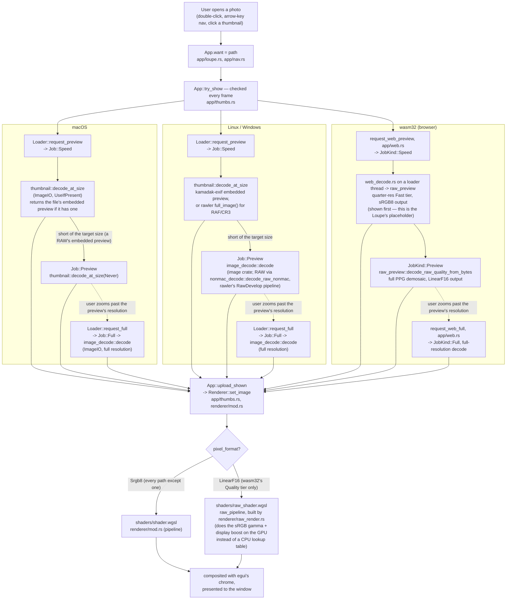
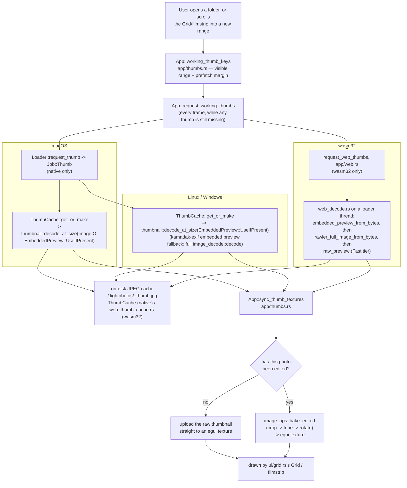
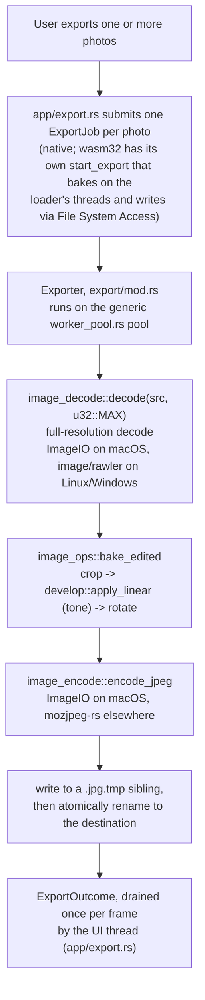
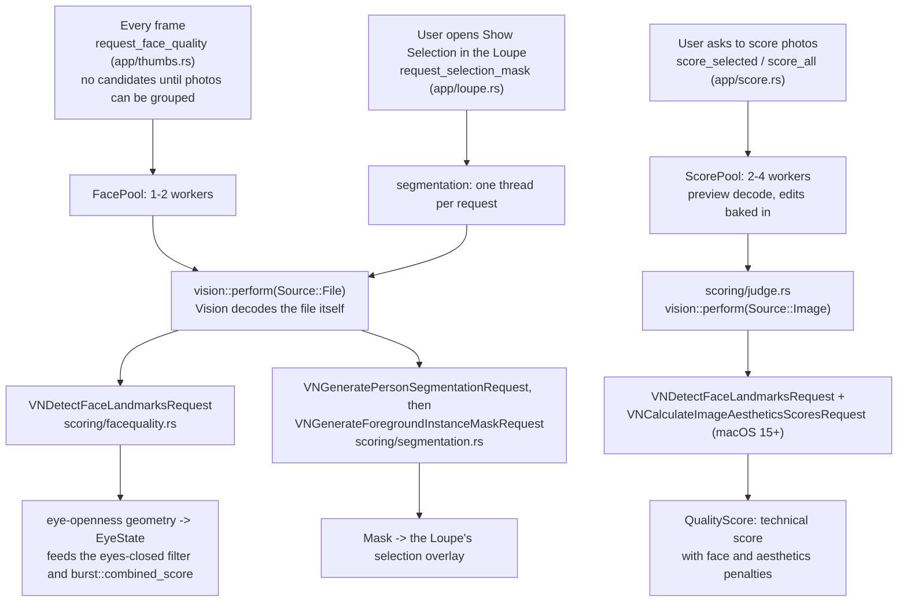

# Architecture: the three decode/render pipelines

This document explains **when** each piece of the codebase runs, in the order
a photo actually moves through it, across the three platform targets: macOS,
Linux/Windows ("non-mac"), and wasm32 (the browser build). It complements
`CLAUDE.md` and [`docs/SYSTEM_DIAGRAM.md`](SYSTEM_DIAGRAM.md)
(architecture diagrams) — this file is about
*sequencing*, not module boundaries.

There are three pipelines a photo passes through, each triggered by a
different user action:

1. **Opening a photo** — decoding it into the Loupe.
2. **Browsing a folder** — decoding thumbnails for the Grid/filmstrip.
3. **Exporting a photo** — baking edits into a JPEG on disk.

All three fork into per-platform decode/encode code but converge back onto
shared, platform-independent code (the tone pipeline, the GPU renderer, the
pixel-ops math) — that convergence is what guarantees the three platforms
*look* the same even though they decode differently.

## Two independent platform axes, not three parallel copies

Before the pipelines: the "three platforms" aren't three separate module
trees. Two independent `cfg` axes combine into three realized cases
(macOS+wasm32 never occurs):

- **`cfg(target_os = "macos")`** — gates everything built on Apple's
  ImageIO/CoreGraphics (`decode/image_decode/mod.rs`, `decode/image_encode.rs`, `jobs/thumbnail.rs`,
  `decode/coregraphics.rs`). The `not(macos)` arm of each is Linux/Windows *and*
  wasm32's fallback code.
- **`cfg(target_arch = "wasm32")`** — gates the browser-only plumbing
  (`web/*.rs`) and the parts of `jobs/loader.rs`/`export/mod.rs` that can't use real OS
  threads there.

What that means in practice:

- "Non-mac" in a doc comment usually means "Linux, Windows, *and* wasm32."
- wasm32 reuses the non-mac decode *functions* (`decode/image_decode/nonmac_decode.rs`,
  `decode/raw_preview.rs`) and runs them on `jobs/loader.rs`'s own worker threads, which
  are wasm threads over one shared memory there. A thread cannot open a File
  System Access handle, so the main thread reads each file and queues its
  bytes (`Job::Web`, through `WebDecoder`).
- wasm32 feeds those results into `jobs/loader.rs`'s caches through a side door
  (`insert_*_external`), because `app/web.rs` owns their retries and disk
  cache.

---

## Pipeline 1 — Opening a photo (the Loupe)

Triggered by: double-clicking a photo, arrow-key navigation, or opening a
file/folder from the command line or Finder.

**Why the two-pass split exists (`Speed` then `Preview`):**
- A RAW file's embedded JPEG preview decodes in ~35ms; demosaicing the
  sensor data to the same size takes ~250ms.
- Showing the cheap pass first and upgrading in place is what makes opening
  a RAW file feel instant instead of frozen.
- A JPEG has no embedded preview, so its Speed pass already decodes at the
  target size — the upgrade pass is skipped entirely, at no extra cost.

**Why wasm32 stops at `LinearF16` for its Quality tier:**
- The full PPG demosaic on wasm32 is CPU-bound and single-photo (not a grid
  flood), so it's worth doing properly.
- Baking the sRGB gamma and display brightness/contrast boost into a CPU
  lookup table (the way every other RAW path does) would mean re-doing that
  work on every zoom/pan repaint.
- Instead the decode stops at linear camera-RGB, uploads as an `Rgba16Float`
  texture, and `shaders/raw_shader.wgsl` does that last step on the GPU once per
  frame instead of once per decode.

**Where full resolution comes from:**
- `Loader::request_full` (native) and `request_web_full` (wasm32) are only
  called once `ensure_full_for_zoom` (`app/loupe.rs`) decides the current
  zoom would show detail the preview doesn't have.
- Normal browsing at "fit to window" never triggers it.

---

## Pipeline 2 — Browsing a folder (Grid / filmstrip thumbnails)

Triggered by: opening a folder, or scrolling the Grid/filmstrip so a new
range of thumbnails becomes the "working set."

**Why the disk cache lives in the photo folder:**
- The picked folder's own File System Access handle is the only place wasm32
  can write, so a cache anywhere else can't exist in a browser at all. Putting
  it beside the photos is what makes the browser build cache thumbnails.
- `.lightphotos/` is already there for ratings and develop edits, is already
  created lazily on first write, and already travels with the photos when a
  folder is moved or copied. The cache inherits all of that, and a folder
  cached natively populates instantly in the browser and the reverse.
- Entries are JPEGs, not raw RGBA: ~45 KB rather than ~700 KB each, which
  matters both in the user's own folder and on web, where every byte crosses
  File System Access.
- One entry per photo, always at `THUMB_PX`, so a folder's cache is bounded
  by its photo count. There is no byte budget; cleanup is
  `thumbnail::sweep_orphans` at folder open, dropping entries whose photo is
  gone or has changed.
- A folder that can't be written just decodes every session. Writes are
  best-effort and their failure is never surfaced.

**Why edits are baked at upload time, not cached alongside the raw
thumbnail:**
- The loader/disk thumbnail cache key is the photo's size and mtime, not its
  edits, so a develop-panel tweak doesn't invalidate the expensive decode.
- Only the cheap `image_ops::bake_edited` re-runs, and only for the texture
  that's actually on screen.

---

## Pipeline 3 — Exporting a photo

Triggered by: File → Export, for one photo or a batch.

**Why exporting bakes pixels rather than reusing a cached decode:**
- Export wants the full-resolution source, which the Loupe/Grid pipelines
  only fetch on demand (zoom-in) or never (thumbnails are capped small).
- So export always does its own full decode, on a worker so it doesn't
  freeze the confirmation modal.

**Where `image_ops::bake_edited` is shared:**
- Export (full resolution) and Grid thumbnails (thumbnail size) are the only
  two callers — nothing else bakes edits into pixels.
- That's deliberate: it's what guarantees an exported JPEG matches what the
  user saw on screen.

---

## Vision signals (macOS only)

Machine learning enters the app in exactly one place, Apple's Vision
framework. Four Vision requests run, all of them trained models that ship
with macOS. No model file lives in this repository, and nothing here is
trained. The OS decides whether a request runs on the Neural Engine, the GPU,
or the CPU, and the app has no say in it.

`vision::perform` (`src/scoring/vision.rs`) runs every request, over one of two
sources:

- `Source::File`: Vision decodes the file itself, at full resolution, inside
  the framework. Nothing goes through `jobs/loader.rs`, its caches, or
  `decode/image_decode/mod.rs`. Face quality and the selection mask use this.
- `Source::Image`: pixels the app already decoded. The quality score uses
  this, so its Vision pass costs no second decode.

**What each request is for:**
- Face landmarks drive blink detection. Vision returns eye landmark points,
  and the scoring on top of them is plain geometry, testable with fabricated
  points.
- Person segmentation, with the general foreground request as a fallback,
  produces the "Show Selection" mask.
- The aesthetics score feeds the quality score. Without it, as on macOS 14
  and earlier or when Vision fails, the score has no aesthetics part.
- Three requests postdate the app's own floor. `Info.plist` declares
  `LSMinimumSystemVersion` 11.0, while `VNGeneratePersonSegmentationRequest`
  needs macOS 12.0, `VNGenerateForegroundInstanceMaskRequest` needs macOS
  14.0 and `VNCalculateImageAestheticsScoresRequest` needs macOS 15.0. The
  floor stays at 11.0, and `vision::require_class` asks the Objective-C
  runtime for each class by name first, so an older system takes the ordinary
  `Err` path instead of aborting the process.

**What is persisted:**
- Face quality and capture time go to `persist/signalcache.rs`, in
  `.lightphotos/signals.json`. They are derived state, so they stay out of
  `ImageRecord`, the user's authored edits.
- The quality score is the exception. `ImageRecord.score` holds it in the
  photo's sidecar, keyed to the edits it was measured on, so a later edit
  marks it stale.
- The selection mask is not persisted.

**What it costs:**
- A `Source::File` call is a second full-resolution decode of a file the app
  has usually already decoded once. That decode happens inside Vision and
  cannot be reused. On 6016x6016 photos, one face analysis measures about
  73 ms, against 32 ms for a whole thumbnail decode (`persist/signalcache.rs`).
- `FacePool` caps at two workers (`cores - 2`, clamped to `1..=2`) to keep
  contention for Vision and the Neural Engine low. `ScorePool` uses
  `cores / 4`, clamped to `2..=4`, apart from the decode pool, so scoring
  never queues ahead of the thumbnails on screen.
- `scoring/facequality.rs`, `scoring/segmentation.rs`, `scoring/judge.rs` and `jobs/score.rs` carry
  `hotpath::measure` call sites, and the profiler's `vision` and
  `select_subject` phases time them.

Off macOS, every entry point here returns `Err`, and the UI keeps that out of
the user's way rather than surfacing it. `App::selection_supported()` is
`cfg!(target_os = "macos")`, so the Loupe's "Show Selection" button does not
render on Linux, Windows or the browser at all. `FacePool::new` returns `None`
when no worker thread starts, which is what happens on wasm32, and `App` then
holds no pool to submit to. `ScorePool::new` returns `None` off macOS, so
scoring does not run there.

## File index

| File | Pipeline stage | Platform |
|---|---|---|
| `jobs/loader.rs` | Job queue + LRU caches for both the Loupe and Grid tiers | native (macOS + Linux/Windows); wasm32 shares its caches via `insert_*_external` but bypasses its queue |
| `decode/image_decode/mod.rs` | Full decode + metadata read, mac arm | macOS |
| `decode/image_decode/nonmac_decode.rs` | Full decode + metadata read, non-mac arm (`image` crate + `rawler`) | Linux/Windows; RAW/JPEG-decode functions also reused by wasm32 |
| `decode/raw_preview.rs` | Two-tier RAW preview (`Fast`/`Quality`) used by the Loupe's wasm32 path | Linux, Windows, wasm32 |
| `renderer/raw_render.rs` | Builds the GPU tonemap pipeline (`shaders/raw_shader.wgsl`) for `PixelFormat::LinearF16` images | all (only ever fed a linear image on wasm32) |
| `jobs/thumbnail.rs` | Decode-at-size for both the Loupe's screen-fit preview and Grid thumbnails, plus the on-disk `.thumb.jpg` cache in `.lightphotos/` | macOS (ImageIO) + Linux/Windows (`kamadak-exif`/`rawler`); wasm32 keeps the same entry naming through `web/web_thumb_cache.rs` |
| `decode/image_encode.rs` | JPEG write for export | macOS (ImageIO) / Linux/Windows (`mozjpeg-rs`) |
| `decode/coregraphics.rs` | Shared CFURL/bitmap-context setup for `decode/image_decode/mod.rs`/`decode/image_encode.rs` | macOS |
| `renderer/mod.rs` | GPU upload + draw of the currently-shown image | all (wgpu → Metal / Vulkan-GL / WebGPU) |
| `develop/mod.rs` | The tone pipeline (`apply_linear`), shared by the GPU shader and the CPU histogram/bake path | all |
| `develop/image_ops.rs` | Pure pixel math (crop/rotate/bake) shared by export and thumbnail baking | all |
| `export/mod.rs` | `Exporter`: decodes, bakes, and encodes a full-resolution JPEG on a `worker_pool.rs` pool; `bake_jpeg` and the `ExportFs` seam are shared | native pool is native-only, wasm32 runs the same bake on the loader's threads |
| `worker_pool.rs` | Generic thread pool behind `Exporter` and `ScorePool` | builds everywhere; no thread starts on wasm32, so the pools run native only |
| `web/web_decode.rs` | Decode and export jobs over a file's bytes, run on the loader's threads | wasm32 |
| `web/web_exports.rs` | Main-thread side of a batch export: each JPEG's destination folder handle, by job id | wasm32 |
| `web/web_canvas.rs` | Attaches winit's canvas into the DOM at the right backing-store resolution | wasm32 |
| `web/web_fs.rs` | File System Access folder picking/listing/byte reads | wasm32 |
| `web/web_catalog_fs.rs` | File System Access counterpart of `persist/catalog.rs`'s sidecar I/O | wasm32 |
| `app/loupe.rs` | View-state math (zoom/pan/fit) and the decision to fetch full resolution | all |
| `app/thumbs.rs` | `try_show`'s tier-selection logic, thumbnail texture sync, capture-time and face signal hooks | all |
| `scoring/vision.rs` | `perform` runs Vision requests over a file (Vision decodes it) or an in-memory image, and blocks | macOS (the module itself is `cfg(target_os = "macos")`) |
| `scoring/facequality.rs` | Face landmarks from Vision, then eye-openness geometry for blink detection; owns `FacePool` | macOS; the non-mac arm returns `Err` |
| `scoring/segmentation.rs` | Person mask, falling back to a general foreground mask, for the Loupe's selection overlay | macOS; the non-mac arm returns `Err`, and the button is hidden by `App::selection_supported()` |
| `scoring/judge.rs` | Quality score: technical measures plus Vision face and aesthetics signals | all; Vision part macOS only, technical-only elsewhere |
| `jobs/score.rs` | `ScorePool`: scores chosen photos on 2-4 low-priority workers | builds everywhere; `ScorePool::new` returns `None` off macOS, where a technical-only score would mislead |
| `persist/signalcache.rs` | Persists capture time and face quality to `.lightphotos/signals.json` | all |
