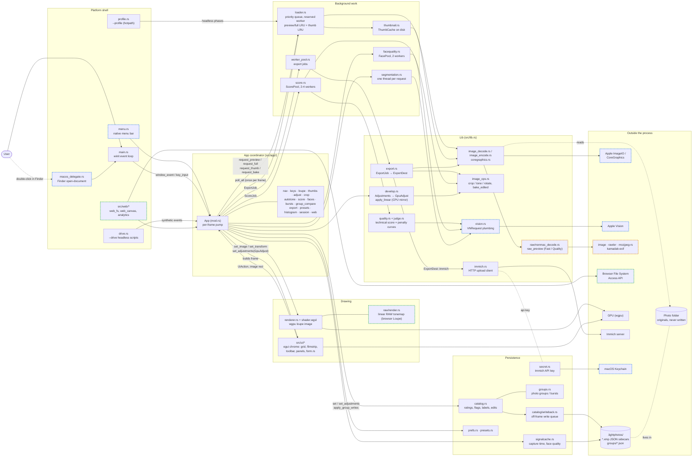
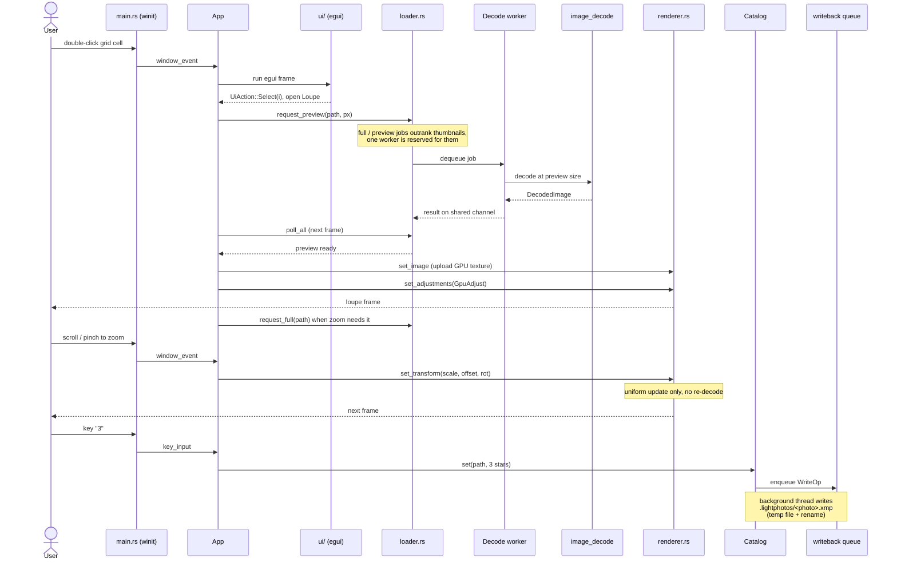

# System diagram

Two views of LightPhotos. The component diagram shows which modules own what and how
they talk. The sequence diagram walks one photo from a click to pixels on screen.
[`PROJECT_LAYOUT.md`](PROJECT_LAYOUT.md) is the module map in prose; read it for the why.

## Components

The app binary (`src/main.rs`, `src/app/`, `src/ui/`) sits on the lib (`src/lib.rs`),
which has no egui, winit or wgpu. Dashed borders mark code that builds on one platform
only: blue is macOS, orange is Linux, Windows and the browser, green is the browser alone.

`facequality.rs`, `segmentation.rs` and the aesthetics half of `judge.rs` build
everywhere but return `Err` (or a flat base score) off macOS, so only `vision.rs` is marked.
`raw/render.rs` compiles everywhere, but only the browser's Loupe RAW path produces the
linear-light images it draws; every other path bakes the tonemap on the CPU.

## Opening a photo

What happens between a click on a grid cell and the photo in the Loupe, then a zoom and
a star rating. The point of the shape: decoding never runs on the UI thread, and a zoom
never decodes.

